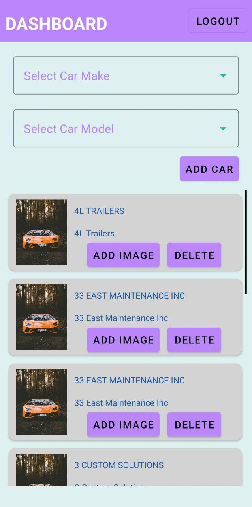
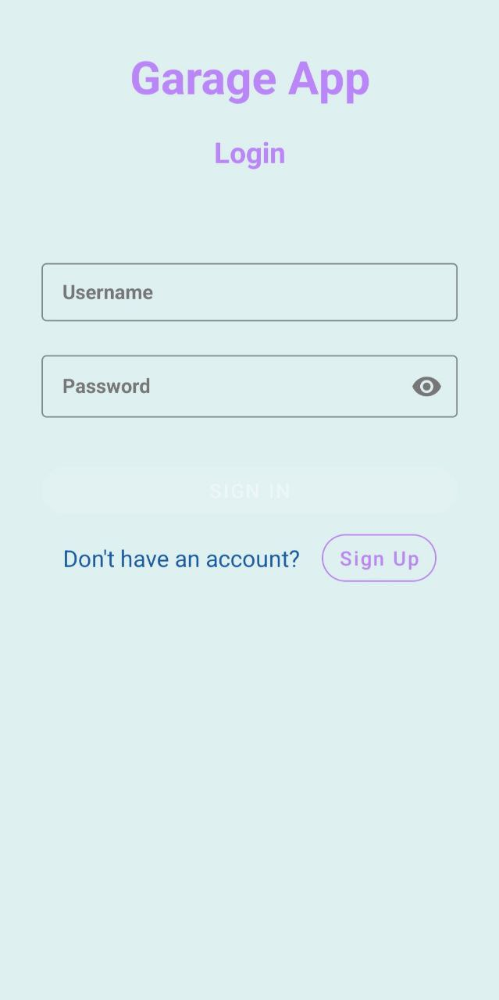
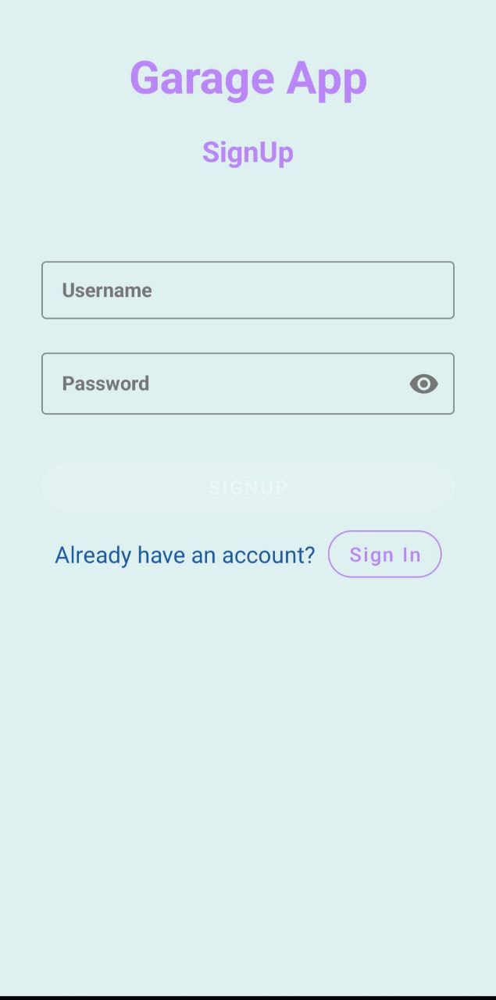

    <h1>Garage App</h1>

An Android app that demonstrates modern Android development with Hilt, Coroutines, Flow, Jetpack (Room, ViewModel) based on MVVM architecture.

 

## Showcase
 

App Screens

    
    
    

 

## Features
- Local Authentication Feature using RoomDB with local validations
- User Session Handling
- Add Car with different Makes and Models

 

## Technology used
App built with Kotlin and Android Jetpack Components.
- Single activity with multiple fragments is used with MVVM architecture.
- Jetpack libraries such as ViewModel, DataBinding, Navigation Component, LiveData.
- Used RoomDB for local caching.
- Used Hilt for Dependency Injection.
- Coroutines and Flow for asynchronous.

 

## Architecture
- MVVM Architecture (View - DataBinding - ViewModel - Model)
- Repository Pattern
- It follows the Google's official architecture guidance.
- The overall architecture of the app is composed of two layers; the UI layer and the data layer. Each layer has dedicated components and they have each different responsibilities.
- Each layer follows unidirectional event/data flow; the UI layer emits user events to the data layer.
- The data layer is designed to work independently from other layers and must be pure, which means it doesn't have any dependencies on the other layers.
- With this loosely coupled architecture, you can increase the reusability of components and scalability of your app.

 

